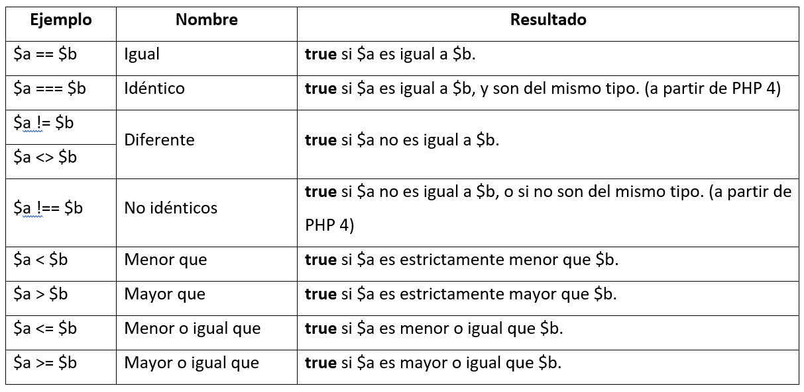
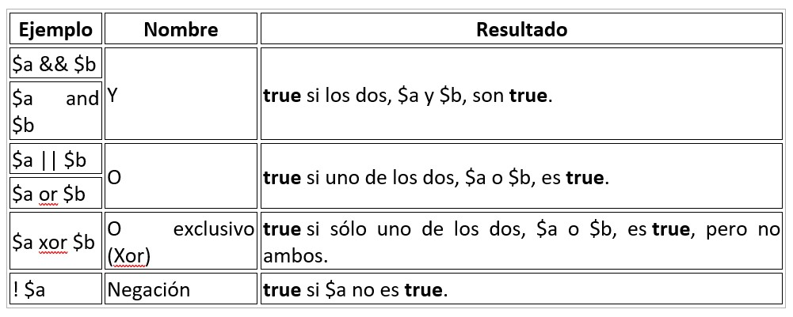

# OPERACIONES

## OPERACIONES VARIABLES

### Operadores Aritméticos

| Ejemplo        |     Nombre     |
| -------------- | :------------: |
| **_-$a_**      |    Negativo    |
| **_$a + $b_**  |      Suma      |
| **_$a - $b_**  |     Resta      |
| **_$a \* $b_** | Multiplicación |
| **_$a / $b_**  |    División    |
| **_$a % $b_**! |     Módulo     |

> [!WARNING]
>
> A la hora de operar un módulo, _$b_ se convertirá a un entero sí o sí. Por ejemplo: El resultado de **"5 % 2.5"** será **1**, no **0**. Aparece esto en el debug: `Deprecated: Implicit conversion from float 2.5 to int loses precision`

- Uso de la función **fmod** para calcular el módulo con números decimales:

  ```php
    $mod = fmod(5,2.5);
    echo $mod; // 0
    $mod_dec = fmod(17, 3.1);
    echo $mod_dec; // 1.5
  ```

> [!NOTE]
>
> Los números enteros no pueden ser muy grandes, según el SO, PHP lo convertirá en un float automáticamente y perderá la precisión. Para **evitar** esto, es necesario utilizar las funciones **bcmath**.

### Operadores de incremento y decremento

| Ejemplo    |     Nombre      |                   Efecto                   |
| ---------- | :-------------: | :----------------------------------------: |
| **_++$a_** | Pre-incremento  | Incrementa _$a_ en uno y luego lo devuelve |
| **_$a++_** | Post-incremento |  Devuelve _$a_ y luego lo incrementa en 1  |
| **_--$a_** | Pre-decremento  |   Reduce _$a_ en uno y luego lo devuelve   |
| **_$a--_** | Post-decremento |    Devuelve _$a_ y luego lo reduce en 1    |

Estos operadores de _INCREMENTO_ funcionan tanto con números como con caracteres.

- Post Incremento con NÚMEROS

  ```PHP
  $valor = 9;
  echo $valor++ . "\n"; // Res: 9
  echo $valor;          // Res: 10
  ```

- Pre Incremento con CARACTERES:

  ```PHP
  $valor = 'aa';
  echo $valor . "\n"; // Res: aa
  echo ++$valor ;     // Res: ab
  ```

- Pre Incremento con una expresión ALFANUMÉRICA:

  ```PHP
  $valor = 'a9z';
  echo $valor . "\n"; // Res: a9z
  echo ++$valor ;     // Res: b0a
  ```

  > [!IMPORTANT]
  >
  > Los operadores de incremento y decrementos tienen prioridad a la hora de ejecutar operadores aritméticos. Por ejemplo, en la operación: `--$a * $b + $c` lo que hará primero sera **DISMINUIR** el valor de $a antes de efectuar la multiplicación con $b y la suma con $c en ese orden. Para ello puedes utilizar los **()** para construir los bloques lógicos.

### Operadores de asignación

Sirven para **simplificar** las expresiones.

| Ejemplo         |     Nombre     |  Equivale a   |
| --------------- | :------------: | :-----------: |
| **_$a += $b_**  |      Suma      | $a = $a + $b  |
| **_$a -= $b_**  |     Resta      | $a = $a - $b  |
| **_$a \*= $b_** | Multiplicación | $a = $a \* $b |
| **_$a /= $b_**  |    División    | $a = $a / $b  |
| **_$a &= $b_**  |     Módulo     | $a = $a & $b  |

### Funciones aritméticas

#### Redondear un número

- **round(x)**: Redondea X al entero más próximo

  ```PHP
    $num1 = 2.6;
    $num2 = 2.2;
    $num3 = - 2.6;
    $num4 = - 2.2;
    echo "Si redondeamos $num1 nos da: ".round($num1) . "\n";
    echo "Si redondeamos $num2 nos da: ".round($num2) . "\n";
    echo "Si redondeamos $num3 nos da: ".round($num3) . "\n";
    echo "Si redondeamos $num4 nos da: ".round($num4) . "\n";
  ```

  También lo podemos utilizar para obtener si un número es entero o no si es que lo utilizamos en un _IF_ comparándolo con el propio número en cuestión.

  - round(x,n): Redondea el número a decimales, centésimas, etc. Esto depende del valor _n_ que le otorgues. Además, puede añadir ceros si es que utilizas un _n_ negativo.

    ```php
    $num = 2.64567;
    $n = 2;
    echo "Si redondeamos $num a $n decimales, nos da: " . round($num,$n) . "\n"; // 2.65
    $num = 246;
    $n = -2;
    echo "Si redondeamos $num a $n centenas, nos da: " . round($num,$n) . "\n"; // 200
    ```

- **floor(x)**: Trunca el entero.

  ```php
    $num1 = 2.6;
    $num2 = 2.2;
    $num3 = - 2.6;
    $num4 = - 2.2;
    echo "Si truncamos $num1 nos da: ".floor($num1) . "\n"; //2
    echo "Si truncamos $num2 nos da: ".floor($num2) . "\n"; //2
    echo "Si truncamos $num3 nos da: ".floor($num3) . "\n"; //-3
    echo "Si truncamos $num4 nos da: ".floor($num4) . "\n"; //-3
  ```

- **ceil(x)**: Redondea el entero al _inmediato_ superior.

  ```php
  $num1 = 2.6;
  $num2 = 2.2;
  $num3 = - 2.6;
  $num4 = - 2.2;
  echo "Si usamos ceil en $num1 nos da: ".ceil($num1) . "\n"; //3
  echo "Si usamos ceil en $num2 nos da: ".ceil($num2) . "\n"; //3
  echo "Si usamos ceil en $num3 nos da: ".ceil($num3) . "\n"; //-2
  echo "Si usamos ceil en $num4 nos da: ".ceil($num4) . "\n"; //-2
  ```

#### Potencias

- **pow(x,y)**: Realiza una potencia, elevando _x_ a _y_.

  ```php
    $x = 3;
    $y = 5;
    echo "Si elevamos $x a la $y nos da: " . pow($x,$y); // 243
  ```

#### Formatear un número

- **number_format(num, dec, $sep_dec, $sep_millar)**: Sirve para darle un formato al número otorgado, lo redondea o trunca según su longitud y le otorga un formato a la hora de separar decimales o unidades de millar (_recuerda que por defecto los decimales se separan con el punto(.)_)

  ```PHP
  $num = 12345678901.234;
  $dec = 2;
  $sep_dec = ',';
  $sep_udMil = ".";
  echo "Vamos a formatear $num con las siguientes parámetros, esto nos da: ".number_format($num, $dec, $sep_dec, $sep_udMil);
  // Vamos a formatear 12345678901.234 con las siguientes parámetros, esto nos da: 12.345.678.901,23
  ```

#### Números aleatorios

- **rand(lower,higher) or mt_rand(lower, higher)**: Son las funciones predeterminadas para obtener un número random entre 2 valores, en teoría _mt_rand()_ es más rápido.

  > [!NOTE]
  >
  > Los números que brindan estas funciones no son criptográficamente seguros, para solucionar eso se agrego la función **random_int()** en PHP 7.0.

  ```PHP
  $low= 1;
  $high = 10;
  echo "Número aleatorio entre $low y $high: ".rand($low, $high) . "\n";
  echo "Número aleatorio entre $low y $high: ".mt_rand($low, $high) . "\n";
  echo "Número aleatorio entre $low y $high: ".random_int($low, $high) . "\n";
  // Número aleatorio entre 1 y 10: 7
  // Número aleatorio entre 1 y 10: 3
  // Número aleatorio entre 1 y 10: 7
  ```

## OPERACIONES LÓGICAS

Son expresiones matemáticas que tienen un resultado **booleano** (true or false). Se usan principalmente en las estructuras de control.

### Comparaciones



Permiten comparar variables o expresiones entre sí o con valores concretos.

```php
$name = 'Orion';
if ($name == "Pepe") {
    echo "Tu nombre es Pepe";
} else {
    echo "Tú no eres Pepe, eres $name";
}
//"Tú no eres Pepe, eres Orion
```

> [!WARNING]
>
> No se debe de confundir el operador comparación (**==**) con el operador asignación (**=**), ya que ocurren errores a la hora de realizar las comparaciones, ya que **=** asigna el nuevo valor a la variable con la que se intento comparar.

```php
$name = 'Orion';
if ($name = "Pepe") {
    echo "Tu nombre es Pepe";
} else {
    echo "Tú no eres Pepe, eres $name";
}
//"Tú eres Pepe ($name cambio de valor en el if ya que se utilizo el operador asignación)
```

Ahora un ejemplo del operador tipo de variable (**===\***);

```PHP
$value1 = 10;
$value2 = "10";
if ($value1 === $value2) {
    echo "Las variables son idénticas";
} else {
    echo "Las variables NO son idénticas";
}
// Las variables NO son idénticas (Ya que value1 es un string y value2 un int)
```

### Operadores lógicos



Nos permiten convertir expresiones simples en más complejas.

```php
$var1 = 'true';
$var2 = 'false';
if ($var1 && $var2) {
    echo "Verdadero";
} else {
    echo "Falso";
}
// Verdadero
```

## EXPRESIONES REGULARES

Nos permiten definir patrones de coincidencia y aplicarlas a las cadenas de texto para saber si cumplen el patrón e incluso poder realizar transformaciones.

Desde PHP 4.0.2. se cuenta con las expresiones regulares compatibles con C PCRE (Perl Compatible Regular Extensions).

### Funciones de expresiones regulares compatibles con PERL

`preg_match($patron, $cadena[, $matriz_coincidencias [, $modificadores [, $desplazamiento]]])`

Se compara una cadena con un patrón, devuelve **1** (si es _true_) o **0** (si es _false_). Esta primera coincidencia se puede guardar en un argumento `$matriz_coincidencias`, aparte, si se añade el modificador **PREG_OFSET_CAPTURE**, este guarda en `$matriz_coincidencias` la **posición** de la coincidencia encontrada. El argumento `$desplazamiento` es un número que nos indica en que carácter se inicio la búsqueda.

> [!NOTE]
>
> Los patrones **SIEMPRE** deben de empezar y cerrarse con el carácter **/**.

```PHP
$cad1 = "1234567890";
$cad2 = "abcdefghijk";
$patron = "/^[[:digit:]]+$/";

if(preg_match($patron, $cad1)){
    echo "La cadena $cad1 SON solo números" . "\n";
} else {
    echo "La cadena $cad1 NO SON solo números" . "\n";
}

if(preg_match($patron, $cad2)){
    echo "La cadena $cad2 SON solo números" . "\n";
} else {
    echo "La cadena $cad2 NO SON solo números" . "\n";
}
// La cadena 1234567890 SON solo números
// La cadena abcdefghijk NO SON solo números
```

Esta función distingue entre mayúsculas y minúsculas. Para que no realice eso debemos de añadir **i** al final del patrón, esto no afecta a las clases [::]

```PHP
$cad = "aaAA";
$patron1 = "/^[a-z]+$/";
$patron2 = "/^[a-z]+$/i";

if (preg_match($patron1, $cad)) {
    echo "La cadena $cad solo tiene MINÚSCULAS". "\n";
} else {
    echo "La cadena $cad NO solo tiene MINÚSCULAS". "\n";
}

if (preg_match($patron2, $cad)) {
    echo "La cadena $cad tiene MINÚSCULAS o MAYÚSCULAS". "\n";
} else {
    echo "La cadena $cad NO tiene MINÚSCULAS o MAYÚSCULAS". "\n";
}
// La cadena aaAA NO solo tiene MINÚSCULAS
// La cadena aaAA tiene MINÚSCULAS o MAYÚSCULAS
```

Ahora utilizando el argumento opcional `$desplazamiento`:

```php
$cad = "Esta es una cadena de prueba";
$patron = "/es/i";
$encontrado = preg_match_all($patron, $cad, $coincidencia, PREG_OFFSET_CAPTURE);
if($encontrado){
    print_r($coincidencia)."\n";
    echo "Se han encontrado coincidencias.\n";
    foreach ($coincidencia[0] as $coincide){
        echo "Cadena: $coincide[0] - Posición: $coincide[1]"."\n";
    }
}else{
    echo "NO se han encontrado coincidencias\n";
}
// Array
// (
//     [0] => Array
//         (
//             [0] => Array
//                 (
//                     [0] => Es
//                     [1] => 0
//                 )
//             [1] => Array
//                 (
//                     [0] => es
//                     [1] => 5
//                 )
//         )
// )
// Se han encontrado coincidencias.
// Cadena: Es - Posición: 0
// Cadena: es - Posición: 5
```

### Sintaxis

Estas expresiones **siempre** deben de empezar y terminar con un delimitador (el predeterminado es: **/**). Estos patrones también permiten **modificadores** en el delimitador final.

> [!NOTE]
>
> Si **/** forma parte del patrón se puede utilizar las siguientes opciones:
>
> - Utilizar una contrabarra antes de la barra: **\\** /
> - Utilizar otro carácter que no sea parte del estándar, por ejemplo: **!**, **-**, etc.

Estos son ejemplos de patrones que son comunes a POSIX y compatibles con PERL.

| Patrón            | Significado                                                                               |
| ----------------- | ----------------------------------------------------------------------------------------- |
| **\_c**\_         | Carácter "c"                                                                              |
| **_._**           | Cualquier carácter                                                                        |
| **_^c_**          | Empezar por el carácter "c"                                                               |
| **_c$_**          | Terminar por el carácter "c"                                                              |
| **_c+_**          | 1 o más caracteres "c"                                                                    |
| **_c\*_**         | 0 o más caracteres "c"                                                                    |
| **_c?_**          | 0 o 1 carácter "c"                                                                        |
| **_\n_**          | Salto de línea                                                                            |
| **_\t_**          | Tabulador                                                                                 |
| **_\\_**          | Slash para escribir adelante otros caracteres especiales: ^, ., %, (), \| , \*, ?, {}, \| |
| **_(cd)_**        | Caracteres "c" y "d" agrupados                                                            |
| **_c \| d_**      | Carácter "c" o "d"                                                                        |
| **_c{n}_**        | _n_ veces el carácter "c"                                                                 |
| **_c{n,}_**       | _n_ o más caracteres "c"                                                                  |
| **_c{n,m}_**      | Desde _n_ hasta _m_ caracteres "c"                                                        |
| **_[a-z]_**       | Letras minúsculas                                                                         |
| **_[A-Z]_**       | Letras minúsculas                                                                         |
| **_[0-9]_**       | Cualquier dígito                                                                          |
| **_[cde]_**       | Cualquiera de los caracteres "c", "d", "e"                                                |
| **_[c-f]_**       | Cualquier letra que este dentro de los caracteres "c" y "f"                               |
| **_[^c]_**        | Empezar por el carácter "c"                                                               |
| **_[[:alnum:]]_** | Cualquier letra o dígito                                                                  |
| **_[[:alpha:]]_** | Cualquier letra                                                                           |
| **_[[:digit:]]_** | Cualquier dígito                                                                          |
| **_[[:lower:]]_** | Cualquier letra minúscula                                                                 |
| **_[[:upper:]]_** | Cualquier letra mayúscula                                                                 |
| **_[[:punct:]]_** | Cualquier marca de puntuación                                                             |
| **_[[:space:]]_** | Cualquier espacio en blanco                                                               |

Estos, en cambio, no existen en POSIX

| Patrón             | Significado                                              |
| ------------------ | -------------------------------------------------------- |
| **_[[:ascii:]]_**  | Caracteres ASCII de 0 a 127                              |
| **_[[:blank:]]_**  | Espacios o tabuladores                                   |
| **_[[:cntrl:]]_**  | Caracteres de control                                    |
| **_[[:graph:]]_**  | Caracteres de impresión, salvo el espacio                |
| **_[[:print:]]_**  | Caracteres de impresión, incluido el espacio             |
| **_[[:word:]]_**   | Cualquier letra o dígito y el guión bajo                 |
| **_[[:xdigit:]]_** | Cualquier dígito hexadecimal                             |
| **_\w_**           | Cualquier letra o dígito y el guión bajo                 |
| **_\W_**           | Cualquier cosa que no sea letra o dígito y el guión bajo |
| **_\s_**           | Cualquier espacio en blanco                              |
| **_\S_**           | Cualquier cosa que no sea un espacio en blanco           |
| **_\d_**           | Cualquier dígito                                         |
| **_\D_**           | Cualquier cosa que no sea un dígito                      |
| **_\b_**           | Inicio o final de palabra                                |
| **_\A_**           | Comienzo                                                 |
| **_\Z_**           | Final, incluye el salto de línea                         |
| **_\z_**           | Final                                                    |

> Para poder practicar con estas expresiones regulares, tenemos la web [RegexTester](https://www.regextester.com/ "Regex Tester") que nos brinda una interfaz sencilla de entender para verificar como funciona la lógica de estas expresiones.

---

> Ahora, si quieres tener una interfaz que te brinde explicaciones sobre el funcionamiento de esas expresiones, contamos con la página [Regex101](https://regex101.com/ "Regex 101")
