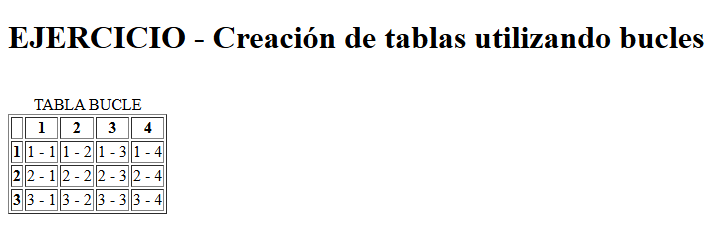

# ESTRUCTURAS DE CONTROL

## ¿QUÉ SON?

Estas estructuras nos permiten modificar el flujo de ejecución de la ejecución de las instrucciones dentro de un código.

## IF - ELSEIF - ELSE

Nos ayudan a condicionar la ejecución de un bloque de sentencias si es que cumplen las condiciones dadas.

### Sintaxis

- IF

  ```php
    if (expresion) {
        sentence_block
    }
  ```

  El _sentence_block_ se va a ejecutar siempre si el resultado de la _expresión_ sea **true**, si es **false** no se ejecuta el bloque.

  Un ejemplo se da en este [fichero](/MD4-Estructuras_Datos/sample/if.php "Sentencia IF"), donde utilizamos esta sentencia para imprimir en pantalla una variable como _H1_ y dotar un color de fondo a la página web.

- IF - ELSE

  ```php
    if (expresion) {
        sentence_block
    }else{
        sentence_block_else
    }
  ```

  En esta expresión, el bloque _sentence_block_else_ se ejecuta cuando la _expresión_ no se cumpla.

  En este [ejemplo](/MD4-Estructuras_Datos/sample/if-else.php "Sentencia IF - ELSE") utilizamos esta estructura para imprimir en pantalla toda una etiqueta de HTML (_\<p> en este caso_) según si se cumple cierta expresión (_en este caso era sobre la variable $color_).

- IF - ELSEIF -IF

  ```php
    if (expresion_1) {
        sentence_block_1
    }elseif (expresion_2){
        sentence_block_2
    ...
    }elseif (expresion_n){
        sentence_block_n
    }else{
        sentence_block_else
    }
  ```

  En esta expresión, el bloque _sentence_block_else_ se ejecuta sí y solo sí no se cumplen las expresiones anteriores, ya que la petición va a ser evaluada por todas la expresiones previas.

  En el siguiente [ejemplo](/MD4-Estructuras_Datos/sample/if-elseif-else.php "Sentencia IF - ELSEIF - ELSE") utilizamos esta estructura para imprimir una imagen y utilizando un formulario de tipo lista desplegable y un botón para ejecutar los cambios.

### Notación abreviada

La estructura IF - ELSE se puede simplificar de esta forma:

```php
$variable = (expresion_1) ? bloque_1 : bloque_2;
```

## SWITCH

Esta expresión es equivalente a la estructura IF - ELSEIF - ELSE, la diferencia es que se evaluara siempre la misma expresión con valores distintos.

```php
switch (expresion) {
    case value_1:
        sentence_block_1;
        break;
    case value_2:
        sentence_block_2;
        break;
    ...
    case value_n:
        sentence_block_n;
        break;
}
```

En el siguiente [ejemplo](./sample/switch.php "Estructura SWITCH") hacemos otra versión del ejemplo anterior, pero utilizando la estructura switch, siendo la expresión a evaluar el **name** de la lista desplegable.

## FOR

```php
for(expresión_inicial; condición_continuación; expresión_paso){
    sentence_block
}
```

**SIEMPRE** se va a evaluar la expresión inicial. La condición se evalúa al principio de cada iteración y esto es crucial a la hora de ejecutar el _sentence_block_ hasta que la condición de **false** y así se cierra el bucle. La expresión de paso aumenta la expresión inicial para poder continuar el bucle.

En el siguiente [ejemplo](./sample/for.php "Estructura FOR") creamos una lista desplegable con un bucle **FOR** y un array, en este caso para añadir elementos solo debemos de modificar el array y listo.

## WHILE

```php
while(expresión){
    sentence_block
}
```

La expresión **siempre** se va a evaluar al inicio de cada iteración. La _sentence_block_ se ejecutará solo sí la expresión devuelve **true** y se cerrará el bucle cuando salga **false**.

Siempre se debe de inicializar la variable a evaluar antes de la estructura de control.

En este [ejemplo](./sample/while.php "Estructura While") hacemos lo mismo que en el ejemplo anterior, solo que utilizamos un bucle While.

## DO... WHILE

```php
do {
    sentence_block
} while (expresión)
```

En este caso la expresión se evalúa **al final** de cada iteración y se ejecuta el _sentence_block_ si la expresión da **true**.

Entonces, este [ejemplo](./sample/do-while.php "Estructura Do While") hacemos lo mismo que en el ejemplo anterior, solo que utilizamos un bucle Do - While.

## FOREACH

Es útil a la hora de recorrer matrices de las cuales no sabemos que tamaño tienen o que tienen índices no correlativos o no numéricos.

```php
foreach ($matriz as $valor){
    sentence_block
}
```

En estos caso el bloque de sentencia se ejecuta tantas veces como elementos tiene la **\$matriz**, y en cada iteración, **$valor** toma el elemento de la matriz que le corresponde.

También tenemos esta versión:

```php
foreach ($matriz as $indice => $valor){
    sentence_block
}
```

La diferencia en este caso es que el índice se especificara con **$indice**.

En el [ejemplo](./sample/foreach.php "Estructura Foreach") siguiente, veras como sacamos los datos de una matriz con foreach, mediante párrafos.

## BUCLES ANIDADOS

Son bucles que se encuentran dentro de otro bucle y pueden ser infinitamente anidados. En estos casos es importante utilizar **variables de control distintas** para no tener problemas a la hora de ejecutar el código

### Variables independientes

```php
for ($i=0;$i < 10; $i++) {
    // Bucle exterior
    for ($j=1; $j < 10; $j++) {
        // Bucle interior
    }
}
```

En este caso, las variables de los bucles no intervienen entre ellos. El bucle exterior se ejecuta _n_ veces y el interior se ejecuta cada _m_ veces cada vez que se ejecuta el bucle exterior.

En este [ejemplo](./sample/bucle-anidado-inde.php "Bucle Anidado Dependiente") vemos esto en párrafos.

### Variables dependientes

```php
for ($i=0;$i < 10; $i++) {
    // Bucle exterior
    for ($j=0; $j < $i; $j++) {
        // Bucle interior
    }
}
```

En este caso las variables de cada bucle **intervienen entre sí**.

El [ejemplo](./sample/bucle-anidado-dep.php "Bucle anidado dependiente") correspondiente nos enseña la distribución de los párrafos.

### EJERCICIO: Creación de tabla

Vamos a crear la siguiente [página](./sample/tables.php "Ejercicio Tablas") utilizando bucles FOR y anidados para crear una tabla.

Nos sale lo siguiente:


