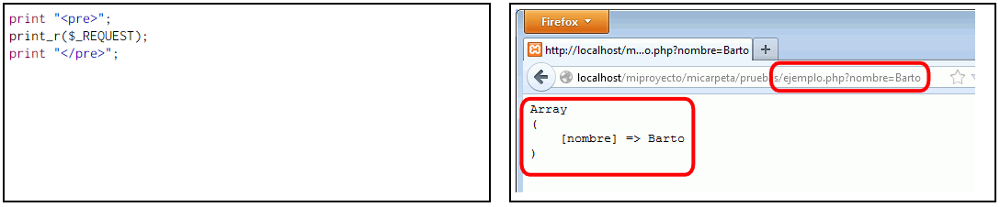
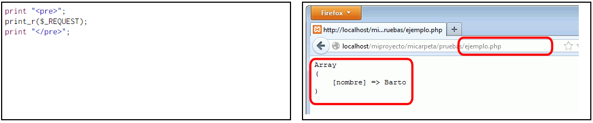
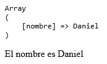
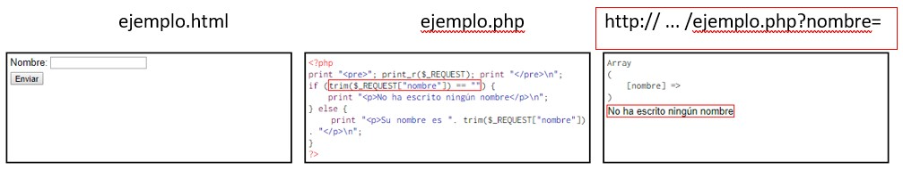

# FORMULARIOS

## Controles en formularios

### Conocimientos previos

- Debemos de incluir el control dentro de un **formulario** (`<form>`).
- El control _php_ debe de ser referenciado en el atributo **action**. (Buena práctica: El archivo _php_ tiene que estar afuera de la página principal)
- Que los `input` tengan el atributo **name** definido.
  - 👀 ➡︎ Si el name tiene espacio, PHP lo reemplazará con un guión bajo a la hora de **procesar** los datos.
- Utilizar un botón tipo **_submit_**.

  ```html
  <form action="sample.php">
    <label>Nombre: <input type="text" name="nombre" /></label>
    <input type="submit" value="Enviar" />
  </form>
  ```

- Los datos se guardan automáticamente en la variable del sistema **$\_REQUEST**

  ```php
    echo "<pre>";
    print_r($_REQUEST);
    echo "</pre>\n";
  ```

- El nombre del elemento de la matriz coincide con lo que colocamos en el atributo _name_, a excepción de los controles tipo imagen.

### Atributo METHOD

Nos permite elegir si la información de los controles se incluye en la llamada a la página (**_get_**) o si se proporciona posteriormente (**_post_**). En temas de **seguridad**, ambos métodos son equivalentes.

> Por defecto, el _method_ siempre sera GET.

La diferencia entre ambos es que el valor **_get_** se ve en la barra del navegador los controles y los valores introducidos por el usuario, en cambio con **_post_** no.

- GET:
  

- POST:
  

### Botón Enviar

Este control se envía **siempre** que este definido el atributo name en el formulario.

Usualmente no se debería de darle un _name_ al botón, pero si el formulario en cuestión contiene varios botones si debemos de hacer ello, para poder reconocerlos.

- HTML:

  ```html
  <form action="sample.php" method="get">
    <p>¿SÍ o NO?</p>
    <input type="submit" name="answer" value="yes" />
    <input type="submit" name="answer" value="no" />
  </form>
  ```

- PHP (**_sample.php_**):

  ```php
  echo "<pre>";
  print_r($_REQUEST);
  echo "</pre>";
  // Array {
  //   [answer] => Si (No)
  // }
  ```

### Caja de texto

```html
<input type="text" name="textbox" value="Introduce un texto" />
```

### Caja de contraseña

```html
<input type="password" name="pass" />
```

### Caja de texto (TEXT BOX)

```html
<textarea rows="4" cols="20" name="textbox"></textarea>
```

### Casilla de verificación

Este control solo se envía si se marca la casilla (se envía: **on**). Ahora, ese valor se puede modificar con el atributo **_value_**.

```html
<input type="checkbox" name="check" value="aceptado" />
```

### Casilla radio (_radio_)

Este control solo se envía si se marca alguno de los botones circulares (radio) que forman el control. El valor predeterminado es **on**. Ahora, ese valor se puede modificar con el atributo **_value_**.

```html
<input type="radio" name="check" value="one" />
<input type="radio" name="check" value="two" />
```

### Menú (`select`)

Este control **siempre** envía la opción elegida. El valor enviado será lo que se encuentre entre las etiquetas `option` o lo que se haya definido en el atributo **_value_** en la etiqueta anteriormente mencionada.

Si deseas una elección multiple, el **_name_** del menú tiene que terminar en **[ ]** y se envía una matriz de respuesta.

Si visualmente deseas que no se genere una **lista desplegable** sino una **caja de opciones**, debemos de añadir lo siguiente: `multiple = "multiple"` y `size = "n_filas"`.

```html
<select name="menu">
  <option value="uno">Opción 1</option>
  <!-- Devuelve uno -->
  <option value="dos">Opción 2</option>
  <!-- Devuelve dos -->
</select>
```

### Control oculto (_hidden_)

Se envía **SIEMPRE** y el valor enviado es el definido en el **_value_**.

```html
<input type="hidden" name="oculto" value="anything" />
```

### Imagen (_image_)

Este control **muestra** una imagen que funciona como un botón de tipo **_submit_**, la diferencia es que envía las _coordenadas_ del punto en donde el usuario ha hecho click.

```html
<input type="image" name="gnu" alt="logo" src="gnu.jpg" />
```

### Archivo (_file_)

Permite enviar un archivo desde el ordenador del cliente al servidor. Si el método utilizado es el **_get_**, este control recibe el nombre del archivo utilizado.

```html
<input type="file" name="archive" />
<!-- {[archive] => sample.txt} -->
```

Si se desea enviar toda la información, el formulario debe de tener el atributo **_enctype_** con el valor _multipart/form-data_ y tener el método **_post_**. Ahora, esta información se almacena en la variable del sistema **$\_FILES**, no en la _\$\_REQUEST_

## Recogida de Datos

### $\_REQUEST

Es la variable del sistema que **_guarda_** la información que envía un formulario.

Tenemos el siguiente [ejemplo](./samples/sample.html "Ejemplo $_REQUEST") donde vemos como funciona esta variable a la hora de recopilar información, cuando se envían los datos aparece la siguiente pantalla, donde se imprime **$\_REQUEST** en forma de **matriz** y como seleccionamos ese valor.



### Comprobación de existencia

Un programa hecho en PHP **nunca** supondrá que los controles les llegaran siempre, sino se producirán errores.

- **_Controles vacíos_**: Si esta todo bien, el programa va a funcionar, aunque no coloques datos en el formulario.

  

  Esto se puede resolver con una estructura **IF - ELSE**.

- **_Controles inexistentes (`isset()`)_**: Es grave que el programa suponga que existe un control que en realidad no llegó al servidor, para ello existe la función `isset($_REQUEST['name_HTML'])` que nos devuelve **true** o **false** según si se marco el control o no.

> Podemos ver la aplicación de esa función en el siguiente [archivo](./samples/actions/isset-sample.php "Ejemplo de uso de la función isset")

### Seguridad en las entradas

Aunque parezca increíble, se puede ingresar líneas de código en las **cajas de texto**, lo cual produce _errores inesperados_ y _riesgos de seguridad_, ya que también se podrían ingresar SQL queries y se podría substraer información. Para ello podemos utilizar los siguientes métodos:

- **_Eliminar etiquetas (`strip_tags($string)`)_**: Esta función devuelve una cadena sin etiquetas tipo HTML, así que en este caso: `<pepe>`, devolvería una cadena vacía.

- **_Eliminar los espacios en blanco (`trim($string)`)_**: Algunos usuarios pueden cometer el error de dejar espacios vacíos en los extremos de la caja de texto y esto puede generar resultados inesperados. Para ello utilizamos la función `trim($string)`.

  

> Podemos ver la aplicación de estas funciones en el siguiente [archivo](./samples/actions/sample.php "Ejemplo de seguridad en las entradas")

### Utilización de variables

Después de haber visto las funciones que nos ayudaran a resolver esos inconvenientes en las entradas en las **cajas de texto** en los _formularios_, es recomendable guardar esas funciones en una variable.

Podemos ver el uso de esta metodología en el siguiente [ejemplo](./samples/actions/uso-variables-form.php "Uso de una variable")

### Salida de datos

Existen caracteres que pueden dar problemas a la hora de imprimir datos, como puede ser el ampersand (&), las comillas (" ", ' '), las desigualdades (<, >), etc. Para poder sustituirlas existe una función llamada `htmlspecialchars()`.

Se puede ver en el siguiente [ejercicio](./samples/actions/function-get.php "Función para recoger datos") como funciona esta función.

### Recoger datos en forma de matriz

Esto funciona a la hora de utilizar más de un `<input>`, para poder tratar esos datos de una mejor manera.

Esto se puede ver en el siguiente [ejemplo](./samples/actions/function-get-array.php "Función GET en forma de array")

## Comprobación de datos

Antes de las comprobaciones que se realizan con comparaciones (si no es null, si es un valor comprendido entre parámetros predeterminados, etc) se debe de comprobar si el dato es del tipo esperado (int, float, string, etc) para procesarlo sin error.

Existen las siguientes familias de funciones:

1. Funciones **is\_\_**
2. Funciones **ctype\_\_**
3. Funciones **filter\_\_**
4. Funciones **\_\_exists**

### Comprobación de números

#### Función is_numeric()

Es útil a la hora de verificar si el dato recibido es un número, devuelve **true** o **false** según la variable ingresada.

#### Función ctype_digit()

Comprueba si el dato recibido es un entero positivo (sin decimales), devuelve **true** si lo que se ingresa son puros dígitos, y **false** cuando no lo son.

### Funciones is\_

#### Funciones donde comprueban la EXISTENCIA de los datos

- **_isset($value)_**: Índica si el dato está definido o no.
- **_is_null($value)_**: Índica si un valor es nulo o no.

#### Funciones que comprueban si los datos son NÚMEROS

- **_is_bool($value)_**: Verifica si el dato es booleano.
- **_is_numeric($value)_**: Número que puede tener decimales, estar definidos en notación exponencial o hexadecimal.
- **_is_int($value)_**: Verifica si un número es entero. Existen funciones equivalentes como son **_is_integer(\$value)_** y **_is_long(\$value)_**.
- **_is_float($value)_**: Verifica si un número es float. Existen funciones equivalentes como son **_is_double(\$value)_** y **_is_real(\$value)_**.

#### Funciones que comprueban si los datos son CADENAS

- **_is_string($value)_**: Verifica si el dato ingresado es una cadena.

#### Otras funcionas que comprueban OTROS tipos de datos

- **_is_scalar($value)_**: Verifica si un dato es entero, float, cadena o booleano.
- **_is_array($value)_**: Verifica si el dato ingresado es una matriz.
- **_is_callable($value)_**: Verifica si el dato ingresado es una función.
- **_is_object($value)_**: Verifica si el dato ingresado es un objeto.
- **_is_resource($value)_**: Verifica si el dato ingresado es un recurso.

> [!IMPORTANT]
>
> Si un dato tiene un tamaño que no soporta la función, todas las funciones devolverán **false**

En la siguiente [página](./samples/verification/verification.html "Ejemplo de una función is_") veremos como se aplica esta función.

### Funciones ctype\_

Funciona a la hora de comprobar si todos los caracteres de una cadena son de un tipo determinado según los caracteres locales.

- **_ctype_alnum($value)_**: Verifica si el tipo de los datos son alfanuméricos.
- **_ctype_alpha($value)_**: Verifica si el dato ingresado es de tipo alfabético, independientemente de que si están en mayúsculas o minúsculas, si tiene acentos, etc.
- **_ctype_cntrl($value)_**: Verifica si el dato recibido tiene caracteres de control, como puede ser el salto de línea o el tabulador.
- **_ctype_digit($value)_**: Verifica si los datos recibidos son dígitos.
- **_ctype_graph($value)_**: Verifica si los datos cuentan con caracteres que se pueden imprimir, excepto espacios.
- **_ctype_print($value)_**: Verifica si los datos cuentan con caracteres que se pueden imprimir.
- **_ctype_lower($value)_**: Verifica si los datos están en minúsculas.
- **_ctype_upper($value)_**: Verifica si los datos están en mayúsculas.
- **_ctype_punct($value)_**: Verifica si los datos cuentan con signos de puntuación.
- **_ctype_space($value)_**: Verifica si los datos cuentan con espacios en blanco.
- **_ctype_xdigit($value)_**: Verifica si los datos cuentan con dígitos hexadecimales.

En la siguiente [página](./samples/verification/verification.html "Ejemplo de una función ctype_") veremos como se aplica esta función.

### Funciones filter\_

Se crearon como una extensión PCL en PHP 5.2. La sintaxis más simple es: `filter_var($var)[$filtro[$opciones]]`, esta devuelve los datos filtrados o **false** si es que el filtro falla.

- **FILTER_VALIDATE_INT**: Filtra si el dato es un número entero.
- **FILTER_VALIDATE_BOOLEAN**: Filtra si el dato es una expresión booleana.
- **FILTER_VALIDATE_FLOAT**: Filtra si el dato es un _float_
- **FILTER_VALIDATE_REGEXP**: Filtra si el dato es una expresión regular.
- **FILTER_VALIDATE_URL**: Filtra si el dato es una URL.
- **FILTER_VALIDATE_EMAIL**: Filtra si el dato es una dirección de email.
- **FILTER_VALIDATE_IP**: Filtra si el dato ingresado es una dirección IP.
- **FILTER_VALIDATE_MAC**: Filtra si el dato es una dirección MAC física.

> Los filtros INT y FLOAT no reconocen el número cero como un entero, así que no es tan efectivo a la hora de detectar números.

En la siguiente [página](./samples/verification/verification.html "Ejemplo de una función filter_") veremos como se aplica esta función.

### Funciones \_exists()

- **_function_exists()_**: Devuelve si la función existe o no. Es útil a la hora de verificar si alguna de las funciones que queremos utilizar sigue siendo parte del estándar o no.
- **_array_key_exists($key, $exists)_**: Se devuelve si el elemento evaluado pertenece a la matriz. Su equivalente es la función `isset()`.
